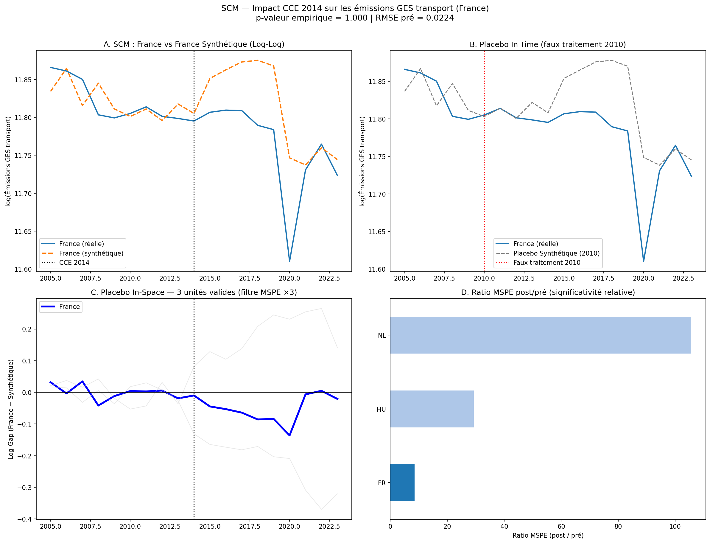
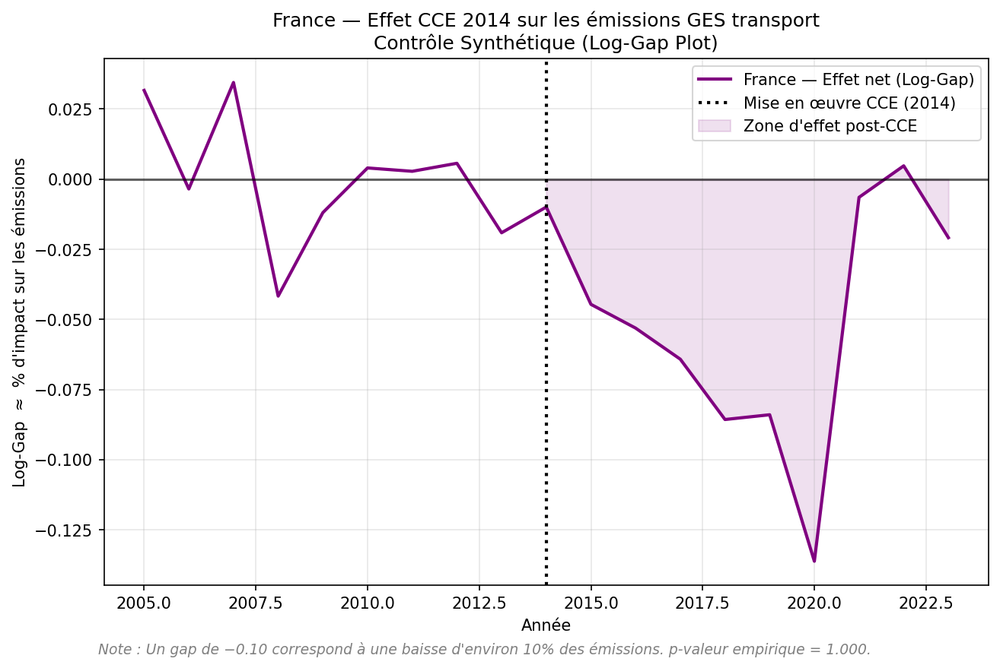

# Carbon Pricing Effects Analysis

**Évaluation causale de l'impact de la Contribution Climat Énergie (CCE) 2014 sur les émissions de GES du secteur transport en France**, par la méthode du Contrôle Synthétique (Abadie, Diamond & Hainmueller, 2010).

> **Statut : recherche exploratoire.** Le pipeline est fonctionnel de bout en bout, mais le résultat obtenu à ce jour **ne satisfait pas** les critères de robustesse fixés par le projet lui-même (voir [Limites et mises en garde](#limites-et-mises-en-garde)). À traiter comme un prototype méthodologique, pas comme une conclusion causale établie.

---

## Sommaire

- [Contexte et question de recherche](#contexte-et-question-de-recherche)
- [Stratégie d'identification](#stratégie-didentification)
- [Résultats](#résultats)
- [Limites et mises en garde](#limites-et-mises-en-garde)
- [Architecture du pipeline](#architecture-du-pipeline)
- [Structure du dépôt](#structure-du-dépôt)
- [Installation](#installation)
- [Utilisation](#utilisation)
- [Configuration](#configuration)
- [Données](#données)
- [Pistes d'évolution](#pistes-dévolution)
- [Références](#références)
- [Licence](#licence)

---

## Contexte et question de recherche

La **Contribution Climat Énergie (CCE)**, introduite en France en 2014, constitue une composante carbone intégrée à la fiscalité des énergies fossiles — un choc de politique quasi-naturel sur le prix implicite du carbone dans les carburants.

**Question posée :** la CCE a-t-elle causé une baisse mesurable des émissions de gaz à effet de serre du secteur transport en France, par rapport à la trajectoire qu'aurait suivie le pays en son absence ?

**Question d'identification sous-jacente**, à garder en tête à chaque lecture des résultats :
> Quelle est la source de variation exploitée, et quelles sont les menaces à la validité interne de l'estimateur ?

## Stratégie d'identification

| Élément | Valeur |
|---|---|
| **Estimateur** | Synthetic Control Method (Abadie, Diamond & Hainmueller, 2010) |
| **Unité traitée** | France (`FR`) |
| **Variable cible** | `env_air_gge` — émissions GES transport (Eurostat, CRF1A3, THS_T) |
| **Choc de traitement** | CCE 2014 |
| **Hypothèse d'identification** | Une combinaison convexe de pays donateurs non traités réplique la trajectoire contrefactuelle de la France en l'absence de CCE |

Le contrefactuel « France synthétique » est une moyenne pondérée de pays donateurs, les poids étant calculés pour minimiser l'écart pré-traitement (2005–2013) sur la variable cible et un jeu de prédicteurs structurels (motorisation, densité de population, part des renouvelables, etc.). Toutes les variables continues sont transformées en **log-log**, de sorte que le gap France − Synthétique s'interprète directement comme un pourcentage d'impact sur les émissions.

Fenêtres temporelles et seuils structurants (`config.py`) :

| Paramètre | Valeur | Rôle |
|---|---|---|
| Entraînement | 2005–2009 | Calcul des poids W (in-sample) |
| Validation | 2010–2013 | Sélection du donor pool sur RMSE out-of-sample |
| Traitement | 2014 | Mise en œuvre de la CCE |
| Placebo in-time | 2010 | Test de rupture de tendance préexistante |
| Fin de panel | 2023 | Dernier millésime Eurostat disponible |
| Seuil MSPE | ×3 erreur France | Filtre des placebos à mauvais pré-fit |

Le donor pool exclut *a priori* les pays ayant une tarification carbone directe antérieure ou concomitante à 2014 (Suède, Finlande, Danemark, Irlande, etc. — cf. `PAYS_CIBLES` dans `config.py`), pour éviter toute contamination du contrefactuel.

## Résultats

Dernière exécution disponible dans `outputs/figures/` :




| Indicateur | Valeur observée |
|---|---|
| RMSE pré-traitement (France) | 0.0224 log-points |
| Donor pool final | 7 pays (DE, EL, HR, HU, NL, PL, RO) |
| Prédicteurs retenus | `road_eqs_carhab`, `sdg_07_11` |
| Unités valides après filtre MSPE ×3 | 3 (FR, HU, NL) |
| Ratio MSPE post/pré — France | ≈ 8 |
| **p-valeur empirique (placebo in-space)** | **1.000** |

**Lecture honnête du résultat :** le pré-fit est bon (RMSE sous le seuil de 0.05 fixé par le projet) et le graphique brut (France réelle vs synthétique) montre une divergence post-2014 visuellement nette. Mais le test de permutation, qui est le juge de robustesse retenu par ce projet, ne la valide pas : sur les 3 seules unités survivant au filtre MSPE, la France a le ratio MSPE post/pré **le plus faible**, ce qui donne la p-valeur maximale possible (1.000) plutôt qu'un résultat significatif. Voir la section suivante.

## Limites et mises en garde

Ce projet documente lui-même une hiérarchie de validité stricte (pré-fit → absence de contamination → significativité des placebos). Sur cette base, l'état actuel présente trois limites qui empêchent une conclusion causale robuste :

1. **Puissance statistique insuffisante du test de permutation.** Le filtre MSPE ×3 élimine 4 des 7 pays du donor pool, ne laissant que 3 unités valides. Avec n=3, la p-valeur empirique ne peut prendre que les valeurs 1/3, 2/3 ou 1 — il est structurellement impossible d'atteindre le seuil usuel de p ≤ 0.10, quelle que soit la réalité de l'effet.
2. **Absence de traitement du choc COVID-19.** Le gap post-2014 rapporté est fortement tiré par l'effondrement de la mobilité en 2020, un choc exogène sans lien avec la CCE. Aucune spécification alternative (sous-périodes, DiD synthétique) n'isole cet effet à ce stade.
3. **Donor pool et jeu de prédicteurs restreints.** Sur 20 pays et 8 séries Eurostat candidates, seuls 7 pays et 2 prédicteurs de base survivent à la sélection gloutonne — notamment, `diesel_price_ht` (le prix du carburant, canal de transmission direct de la CCE) n'est jamais retenu, probablement du fait d'un critère d'exclusion sur données manquantes très strict.

**En clair : le graphique de gap seul ne suffit pas à conclure à un effet causal de la CCE sur ce panel.** Voir [Pistes d'évolution](#pistes-dévolution) pour les leviers identifiés afin de renforcer l'inférence.

## Architecture du pipeline

```
run_pipeline.py
│
├── Stage 1 — src/data_pipeline.py
│   Entrées : API Eurostat (live) + Data/raw/oil/Weekly_Oil_Bulletin_*.xlsx
│   Sortie  : Data/processed/master_dataset_final_scm.csv
│
├── Stage 2 — src/donor_selection.py
│   Entrée  : Data/processed/master_dataset_final_scm.csv
│   Algo    : optimisation alternée (moteur A : pays, moteur B : prédicteurs)
│   Sortie  : Data/processed/optimal_joint_panel.csv
│
└── Stage 3 — src/scm_estimation.py
    Entrée  : Data/processed/optimal_joint_panel.csv
    Tests   : placebo in-space, placebo in-time (2010), filtre MSPE (×3)
    Sorties : outputs/figures/scm_results_YYYYMMDD.png
              outputs/figures/scm_gap_YYYYMMDD.png
```

Chaque stage peut être relancé indépendamment via `run_pipeline.py` (voir [Utilisation](#utilisation)). Les paramètres structurants sont centralisés dans `config.py` et ne doivent pas être modifiés sans validation (cf. `AGENTS.md`).

## Structure du dépôt

```
.
├── AGENTS.md                    # Instructions détaillées pour intervention sur le projet
├── config.py                    # Paramètres centralisés (chemins, fenêtres, seuils, donor pool)
├── run_pipeline.py              # Point d'entrée unique (orchestration des 3 stages)
├── requirements.txt
├── docs/
│   └── synthese_technique.md    # Cadre analytique et stratégie d'identification détaillée
├── src/
│   ├── data_pipeline.py         # Stage 1 — ingestion Eurostat + Weekly Oil Bulletin
│   ├── donor_selection.py       # Stage 2 — sélection optimale du donor pool
│   └── scm_estimation.py        # Stage 3 — estimation SCM + tests de robustesse
├── Data/
│   ├── raw/                     # Sources brutes (Eurostat, Weekly Oil Bulletin)
│   └── processed/               # Master dataset et panel optimal (générés)
└── outputs/
    └── figures/                 # Graphiques SCM générés (datés YYYYMMDD)
```

> `main.py`, `donor_selection.py` et `econ_analysis.py` à la racine sont d'anciens scripts, conservés comme stubs qui lèvent une erreur explicite pointant vers `src/` — ne pas les utiliser.

## Installation

Prérequis : Python ≥ 3.10.

```bash
git clone https://github.com/hcollotd2-crypto/Carbon-pricing-effects-analysis.git
cd Carbon-pricing-effects-analysis
python3 -m venv .venv
source .venv/bin/activate
pip install -r requirements.txt
```

## Utilisation

```bash
# Pipeline complet (télécharge les données, sélectionne le donor pool, estime le SCM)
python run_pipeline.py

# Reprendre à partir d'un stage donné (si les données amont existent déjà)
python run_pipeline.py --from stage2
python run_pipeline.py --from stage3

# Exécuter un seul stage
python run_pipeline.py --only stage3
```

Les stages peuvent aussi être exécutés directement :

```bash
python src/data_pipeline.py
python src/donor_selection.py
python src/scm_estimation.py
```

Les résultats numériques (RMSE, poids, p-valeur) sont imprimés dans la console à chaque exécution du Stage 3 ; les figures sont écrites dans `outputs/figures/`.

## Configuration

Toute modification structurante passe par `config.py`. Principaux leviers :

| Paramètre | Rôle |
|---|---|
| `PAYS_CIBLES` | Liste des pays candidats au donor pool |
| `TREATED_UNIT`, `TARGET_VAR` | Unité traitée et variable cible |
| `TRAIN_START` / `TRAIN_END` / `VAL_END` / `TREATMENT_YEAR` / `PLACEBO_YEAR` / `PANEL_END` | Fenêtres temporelles |
| `MIN_DONORS`, `MIN_PREDICTORS`, `MAX_ITER` | Paramètres de l'optimisation alternée (Stage 2) |
| `MSPE_THRESHOLD` | Seuil d'exclusion des placebos à mauvais pré-fit |
| `CODES_EUROSTAT`, `FILTRES_EUROSTAT` | Séries Eurostat téléchargées et filtres appliqués |

Voir `docs/synthese_technique.md` pour la justification économétrique de chaque paramètre.

## Données

| Source | Contenu | Accès |
|---|---|---|
| [Eurostat](https://ec.europa.eu/eurostat) | Émissions GES transport, motorisation, densité, énergie, PIB | API live (`eurostat` package Python) |
| [Weekly Oil Bulletin](https://energy.ec.europa.eu/) | Prix hebdomadaires du diesel hors taxes | Fichier Excel fourni dans `Data/raw/oil/` |

⚠️ Les données Eurostat sont récupérées en direct via API à chaque exécution du Stage 1 ; les millésimes peuvent être révisés par Eurostat entre deux exécutions, ce qui peut faire varier légèrement les résultats d'une run à l'autre. Les CSV présents dans `Data/raw/eurostat/` sont des extraits partiels de référence, pas un snapshot figé utilisé par le pipeline.

## Pistes d'évolution

Par ordre de priorité pour renforcer la robustesse de l'inférence :

1. **Élargir le pool de contrôle** au-delà de l'UE (OCDE : USA, Canada, Australie, Japon, Corée du Sud) pour augmenter le nombre d'unités valides après filtre MSPE — seul levier réel pour sortir du plancher de p-valeur actuel (n=3).
2. **Assouplir le critère d'exclusion sur données manquantes** dans la sélection des prédicteurs (Stage 2), pour permettre l'inclusion de `diesel_price_ht`, actuellement écarté malgré sa pertinence théorique directe.
3. **Isoler l'effet COVID-19** via une spécification Synthetic Difference-in-Differences ou une lecture séparée 2014–2019 / 2020–2023.
4. **Comparer à des estimateurs alternatifs** (DiD à deux voies, inférence conforme à la Chernozhukov et al.) pour tester la stabilité du signe et de l'ordre de grandeur hors du cadre SCM strict.
5. **Étendre l'analyse à d'autres secteurs énergétiques** (résidentiel, industrie) couverts par la CCE, moins exposés au confondant de mobilité COVID que le transport seul.
6. **Automatiser la traçabilité des résultats** : journaliser à chaque exécution du Stage 3 (date, RMSE, p-valeur, donor pool, prédicteurs) dans un fichier de log ou le tableau de `docs/synthese_technique.md`.

## Références

- Abadie, A., Diamond, A., & Hainmueller, J. (2010). *Synthetic Control Methods for Comparative Case Studies.* Journal of the American Statistical Association, 105(490), 493–505.
- Abadie, A. (2021). *Using Synthetic Controls: Feasibility, Data Requirements, and Methodological Aspects.* Journal of Economic Literature, 59(2), 391–425.
- [World Bank Carbon Pricing Dashboard](https://carbonpricingdashboard.worldbank.org)

## Licence

Aucune licence n'est actuellement définie pour ce dépôt. Contacter l'auteur avant toute réutilisation.
