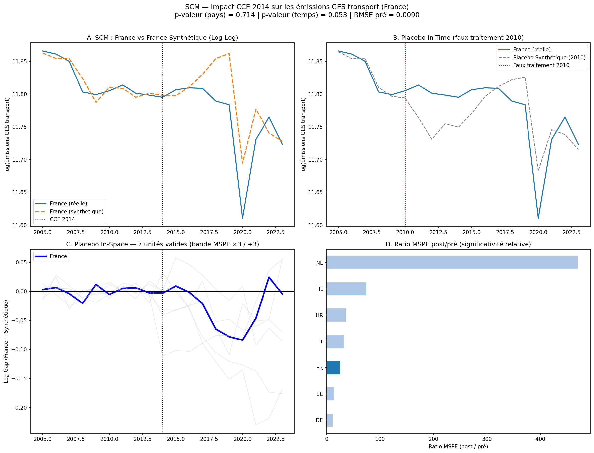
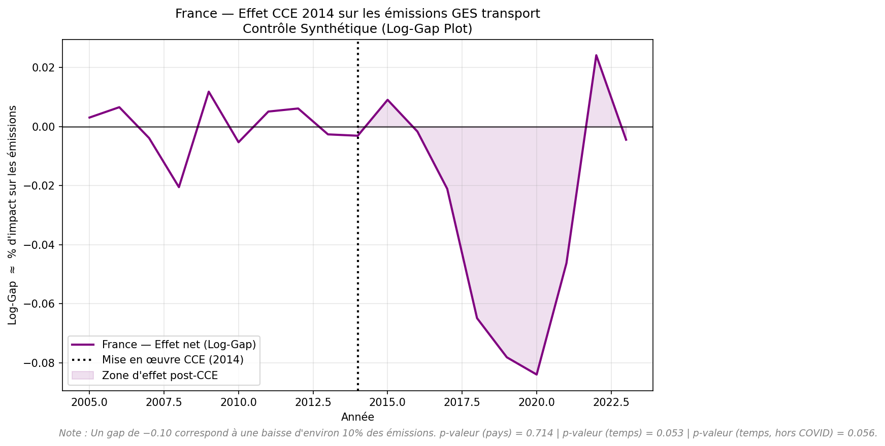

# Carbon Pricing Effects Analysis

**Évaluation causale de l'impact de la Contribution Climat Énergie (CCE) 2014 sur les émissions de GES du secteur transport en France**, par la méthode du Contrôle Synthétique (Abadie, Diamond & Hainmueller, 2010).

> **Statut : recherche exploratoire.** Le pipeline est fonctionnel de bout en bout, mais le résultat obtenu à ce jour **ne satisfait pas** les critères de robustesse fixés par le projet lui-même (voir [Limites et mises en garde](#limites-et-mises-en-garde)). À traiter comme un prototype méthodologique, pas comme une conclusion causale établie.

---

## Sommaire

- [Contexte et question de recherche](#contexte-et-question-de-recherche)
- [Stratégie d'identification](#stratégie-didentification)
- [Résultats](#résultats)
- [Limites et mises en garde](#limites-et-mises-en-garde)
- [Architecture du pipeline](#architecture-du-pipeline)
- [Structure du dépôt](#structure-du-dépôt)
- [Installation](#installation)
- [Utilisation](#utilisation)
- [Configuration](#configuration)
- [Données](#données)
- [Pistes d'évolution](#pistes-dévolution)
- [Références](#références)
- [Licence](#licence)

---

## Contexte et question de recherche

La **Contribution Climat Énergie (CCE)**, introduite en France en 2014, constitue une composante carbone intégrée à la fiscalité des énergies fossiles — un choc de politique quasi-naturel sur le prix implicite du carbone dans les carburants.

**Question posée :** la CCE a-t-elle causé une baisse mesurable des émissions de gaz à effet de serre du secteur transport en France, par rapport à la trajectoire qu'aurait suivie le pays en son absence ?

**Question d'identification sous-jacente**, à garder en tête à chaque lecture des résultats :
> Quelle est la source de variation exploitée, et quelles sont les menaces à la validité interne de l'estimateur ?

## Stratégie d'identification

| Élément | Valeur |
|---|---|
| **Estimateur** | Synthetic Control Method (Abadie, Diamond & Hainmueller, 2010) |
| **Unité traitée** | France (`FR`) |
| **Variable cible** | `env_air_gge` — émissions GES transport (Eurostat, CRF1A3, THS_T) |
| **Choc de traitement** | CCE 2014 |
| **Hypothèse d'identification** | Une combinaison convexe de pays donateurs non traités réplique la trajectoire contrefactuelle de la France en l'absence de CCE |

Le contrefactuel « France synthétique » est une moyenne pondérée de pays donateurs, les poids étant calculés pour minimiser l'écart pré-traitement (2005–2013) sur la variable cible et un jeu de prédicteurs structurels (motorisation, densité de population, part des renouvelables, etc.). Toutes les variables continues sont transformées en **log-log**, de sorte que le gap France − Synthétique s'interprète directement comme un pourcentage d'impact sur les émissions.

Fenêtres temporelles et seuils structurants (`config.py`) :

| Paramètre | Valeur | Rôle |
|---|---|---|
| Entraînement | 2005–2009 | Calcul des poids W (in-sample) |
| Validation | 2010–2013 | Sélection du donor pool sur RMSE out-of-sample |
| Traitement | 2014 | Mise en œuvre de la CCE |
| Placebo in-time | 2010 | Test de rupture de tendance préexistante |
| Fin de panel | 2023 | Dernier millésime Eurostat disponible |
| Seuil MSPE | ×3 erreur France | Filtre des placebos à mauvais pré-fit |

Le donor pool exclut *a priori* les pays ayant une tarification carbone directe antérieure ou concomitante à 2014 (Suède, Finlande, Danemark, Irlande, etc. — cf. `PAYS_CIBLES` dans `config.py`), pour éviter toute contamination du contrefactuel.

## Résultats

Dernière exécution disponible dans `outputs/figures/` (Stage 3 relancé le 2026-09-17 sur le pool étendu à 3 pays OCDE hors UE — voir [Architecture du pipeline](#architecture-du-pipeline)) :




| Indicateur | Valeur observée |
|---|---|
| RMSE pré-traitement (France) | **0.0090 log-points** (deux fois meilleur que la version UE seule) |
| Donor pool SCM (outcome-only, Stage 3, 23 candidats) | US (0.487), LU (0.209), IL (0.172), AT (0.105), EL (0.018), BG (0.007), TR (0.003) — **DE : 0%** |
| Unités valides après filtre MSPE (bornes ×3 / ÷3) | 7 |
| Ratio MSPE post/pré — France | 25.57 (rang 5/7) |
| p-valeur empirique — placebo in-space (pays) | 0.714 |
| **p-valeur empirique — placebo in-time (permutation temporelle, 18 tirages)** | **0.053** |
| p-valeur (temps, hors année COVID 2020) | 0.056 |
| Gap moyen post-2014 | −0.027 log-points ≈ **−2,7 %** d'émissions GES transport |

**Lecture honnête du résultat :** l'extension à 3 pays OCDE hors UE (États-Unis, Turquie, Israël — voir justification et méthode ci-dessous) a résolu la dépendance structurelle à l'Allemagne identifiée plus tôt dans la journée : son poids tombe à 0%, remplacé par une combinaison plus diversifiée dominée par les États-Unis. Le pré-fit s'améliore nettement (RMSE divisé par deux). **Le test de permutation temporelle passe pour la première fois sous le seuil conventionnel de 0.10** (0.053, et 0.056 hors choc COVID — donc pas un artefact pandémique). Le test par pays, lui, ne passe toujours pas ce seuil (0.714) : les deux tests continuent de raconter des histoires différentes. **Ce n'est pas encore une preuve causale établie** — voir les mises en garde ci-dessous, notamment sur la composition inhabituelle du nouveau donor pool.

### Comment on est arrivés là (2026-09-17)

**Sensibilité au seuil MSPE** (checklist §5 du projet), sur le pool UE seul (20 pays) avant extension — stable, pas de cherry-picking sur le choix ×3 :

| Seuil | Unités valides | Rang France | p-valeur |
|---|---|---|---|
| ×2 | 4 | 3 | 0.750 |
| ×3 | 8 | 6 | 0.750 |
| ×5 | 12 | 9 | 0.750 |

**Leave-one-out sur le pool UE (20 pays)** avait révélé une fragilité critique : retirer l'Allemagne (76.5% du poids) faisait exploser le RMSE pré-traitement (0.018 → 0.149, huit fois le seuil de 0.05) et inversait le signe du gap post-2014.

**Deux corrections tentées à l'intérieur du même pool UE, deux échecs instructifs :**
- *Ridge sur les poids* (pénalité L2 croissante) : ne dilue quasiment rien tant que la pénalité reste modérée (poids DE encore à 56.5% pour λ=0.3, RMSE alors dégradé à 0.030).
- *SCM augmenté avec prédicteurs structurels* (`run_scm_predictor_augmented`, motorisation + part renouvelables + prix diesel) : **aggrave** la concentration (poids DE à 96.2%) — l'Allemagne s'avère être le meilleur match de la France aussi sur ces caractéristiques structurelles, pas seulement sur la trajectoire des émissions. Cette variante reste disponible (Stage 3bis) mais n'est pas retenue.

**Extension OCDE (`src/oecd_extension.py`)** : plutôt que repondérer le même échantillon de ~20 économies d'Europe, élargissement à des pays structurellement différents. Classification du risque de contamination carbone (protocole §4 du projet) : USA, Turquie et Israël retenus comme candidats à **risque faible** (aucune tarification carbone nationale directe sur 2005–2023) ; Canada, Corée du Sud et Chili identifiés comme candidats à risque moyen pour une extension ultérieure ; Japon, Nouvelle-Zélande, Australie et Mexique exclus (taxe/ETS antérieur ou concomitant à 2014). Données sourcées via l'UNFCCC GHG Data Interface (catégorie CRF 1.A.3 Transport, gaz agrégés) — validées par comparaison directe avec la série France Eurostat (écart < 1%, même creux COVID 2020).

**Nouveau leave-one-out sur le pool étendu (23 candidats)** — nettement plus robuste que la version UE seule :

| Donneur retiré | RMSE pré | Gap post moyen | Signe préservé ? |
|---|---|---|---|
| US (nouveau donneur principal) | 0.0177 (×2, reste sous le seuil 0.05) | −0.047 | ✅ |
| LU | 0.0104 | −0.057 | ✅ |
| IL | 0.0097 | −0.035 | ✅ |
| AT | 0.0092 | −0.013 | ✅ |
| EL | 0.0091 | −0.035 | ✅ |

Plus aucun donneur, y compris le nouveau plus gros contributeur (US, 48.7%), ne produit d'explosion du RMSE ou d'inversion de signe en son absence — la différence la plus importante avec la situation d'avant l'extension.

## Limites et mises en garde

Ce projet documente lui-même une hiérarchie de validité stricte (pré-fit → absence de contamination → significativité des placebos). Sur cette base, l'état actuel présente les limites suivantes :

1. **Le test par pays ne franchit toujours pas le seuil de significativité (p = 0.714), contrairement au test temporel.** Les deux tests continuent de diverger : le ratio MSPE de la France (25.57) n'est pas dans la queue supérieure de la distribution des 7 placebos valides. Un résultat positif sur un seul des deux tests de robustesse retenus par le projet n'est pas, à lui seul, une preuve causale.
2. **Composition du nouveau donor pool à surveiller.** Le Luxembourg (20.9% du poids) est une économie atypique pour les métriques liées au carburant : le « tourisme à la pompe » transfrontalier lié à une fiscalité plus basse gonfle ses émissions de transport par habitant, ce qui questionne sa comparabilité structurelle avec la France au-delà du seul critère de pré-fit statistique. Pas un critère d'exclusion carbone au sens du protocole du projet, mais un point de vigilance distinct.
3. **Les données OCDE (US/TR/IL) s'arrêtent en 2021 dans le snapshot archivé UNFCCC utilisé** (l'API live de l'UNFCCC est bloquée pour les environnements standards). Les années 2022–2023 sont comblées par la même interpolation de bord que le reste du pipeline — une extrapolation, pas une observation réelle — pour des pays qui pèsent désormais une bonne part du contrefactuel.
4. **Seuls les candidats à risque carbone faible ont été intégrés pour l'instant** (USA, Turquie, Israël). Canada, Corée du Sud et Chili (risque moyen, documentés mais pas encore inclus) pourraient changer à nouveau la composition du pool — voir [Pistes d'évolution](#pistes-dévolution).
5. **Absence de traitement approfondi du choc COVID-19.** Le test de permutation temporelle hors 2020 confirme que le résultat n'est pas qu'un artefact pandémique (p = 0.056 vs 0.053), mais aucune spécification alternative (sous-périodes, DiD synthétique) n'isole complètement cet effet à ce stade.
6. **`diesel_price_ht` reste écarté du Stage 2**, malgré son éligibilité désormais complète après l'imputation TimesFM — une limite de spécification (sélection gloutonne sur critère RMSE), pas de disponibilité des données.

**En clair : la situation s'est nettement améliorée aujourd'hui (le test temporel franchit le seuil conventionnel), mais un seul test sur deux y parvient, et la composition du nouveau donor pool appelle une lecture prudente plutôt qu'une conclusion causale définitive.**

## Architecture du pipeline

```
run_pipeline.py
│
├── Stage 1 — src/data_pipeline.py
│   Entrées : API Eurostat (live) + Data/raw/oil/Weekly_Oil_Bulletin_*.xlsx
│   Sortie  : Data/processed/master_dataset_final_scm.csv
│
├── Stage 2 — src/donor_selection.py
│   Entrée  : Data/processed/master_dataset_final_scm.csv
│   Algo    : optimisation alternée (moteur A : pays, moteur B : prédicteurs)
│   Sortie  : Data/processed/optimal_joint_panel.csv
│
├── Stage 3 — src/scm_estimation.py
│   Entrée  : Data/processed/master_dataset_final_scm.csv (tous les PAYS_CIBLES,
│             indépendant du Stage 2 — voir note méthodologique en tête du fichier)
│   Tests   : placebo in-space (bande MSPE ×3/÷3), placebo in-time (2010),
│             permutation temporelle (+ contrôle hors COVID), leave-one-out,
│             sensibilité au seuil MSPE (×2/×3/×5)
│   Sorties : outputs/figures/scm_results_YYYYMMDD.png / scm_gap_YYYYMMDD.png
│   + Stage 3bis (même fichier, run_scm_predictor_augmented) : variante avec
│     road_eqs_carhab/nrg_ind_ren/diesel_price_ht comme prédicteurs plutôt
│     que les seuls lags de la cible — testée, pas retenue (voir Résultats)
│     → outputs/figures/scm_results_predictors_YYYYMMDD.png / scm_gap_predictors_YYYYMMDD.png
│
├── Stage optionnel — src/timesfm_imputation.py  (--only impute, entre Stage 1 et 2)
│   Entrée/Sortie : Data/processed/master_dataset_final_scm.csv (écrasé, complété)
│   Remplace le flat-fill des bords utilisé par défaut dans Stages 2/3
│   (pandas interpolate limit_direction='both') par un forecast/backcast
│   TimesFM 2.5 — nécessite l'environnement dédié .venv-timesfm (voir
│   scripts/setup_timesfm_env.sh), incompatible avec le .venv principal.
│
└── Extension OCDE — src/oecd_extension.py
    Sortie : Data/raw/unfccc/transport_ghg_non_eu.csv (snapshot mis en cache)
    Récupère env_air_gge (CRF 1.A.3 Transport) pour des pays OCDE hors UE à
    risque carbone faible (USA, Turquie, Israël) via unfccc-di-api
    (ZenodoReader — l'API live UNFCCC étant bloquée pour les environnements
    standards). Fusionné automatiquement par Stage 3 via config.OECD_EXTRA_PATH.
```

Chaque stage peut être relancé indépendamment via `run_pipeline.py` (voir [Utilisation](#utilisation)). Les paramètres structurants sont centralisés dans `config.py` et ne doivent pas être modifiés sans validation (cf. `AGENTS.md`).

## Structure du dépôt

```
.
├── AGENTS.md                    # Instructions détaillées pour intervention sur le projet
├── config.py                    # Paramètres centralisés (chemins, fenêtres, seuils, donor pool)
├── run_pipeline.py              # Point d'entrée unique (orchestration des 3 stages)
├── requirements.txt
├── docs/
│   └── synthese_technique.md    # Cadre analytique et stratégie d'identification détaillée
├── src/
│   ├── data_pipeline.py         # Stage 1 — ingestion Eurostat + Weekly Oil Bulletin
│   ├── donor_selection.py       # Stage 2 — sélection optimale du donor pool
│   ├── scm_estimation.py        # Stage 3 — estimation SCM + tests de robustesse
│   ├── timesfm_imputation.py    # Stage optionnel — imputation TimesFM
│   └── oecd_extension.py        # Extension optionnelle — pays OCDE hors UE (UNFCCC)
├── Data/
│   ├── raw/                     # Sources brutes (Eurostat, Weekly Oil Bulletin, UNFCCC)
│   └── processed/               # Master dataset et panel optimal (générés)
└── outputs/
    └── figures/                 # Graphiques SCM générés (datés YYYYMMDD)
```

> `main.py`, `donor_selection.py` et `econ_analysis.py` à la racine sont d'anciens scripts, conservés comme stubs qui lèvent une erreur explicite pointant vers `src/` — ne pas les utiliser.

## Installation

Prérequis : Python ≥ 3.10.

```bash
git clone https://github.com/hcollotd2-crypto/Carbon-pricing-effects-analysis.git
cd Carbon-pricing-effects-analysis
python3 -m venv .venv
source .venv/bin/activate
pip install -r requirements.txt
```

## Utilisation

```bash
# Pipeline complet (télécharge les données, sélectionne le donor pool, estime le SCM)
python run_pipeline.py

# Reprendre à partir d'un stage donné (si les données amont existent déjà)
python run_pipeline.py --from stage2
python run_pipeline.py --from stage3

# Exécuter un seul stage
python run_pipeline.py --only stage3
```

Les stages peuvent aussi être exécutés directement :

```bash
python src/data_pipeline.py
python src/donor_selection.py
python src/scm_estimation.py
```

Les résultats numériques (RMSE, poids, p-valeur) sont imprimés dans la console à chaque exécution du Stage 3 ; les figures sont écrites dans `outputs/figures/`.

## Configuration

Toute modification structurante passe par `config.py`. Principaux leviers :

| Paramètre | Rôle |
|---|---|
| `PAYS_CIBLES` | Liste des pays candidats au donor pool |
| `TREATED_UNIT`, `TARGET_VAR` | Unité traitée et variable cible |
| `TRAIN_START` / `TRAIN_END` / `VAL_END` / `TREATMENT_YEAR` / `PLACEBO_YEAR` / `PANEL_END` | Fenêtres temporelles |
| `MIN_DONORS`, `MIN_PREDICTORS`, `MAX_ITER` | Paramètres de l'optimisation alternée (Stage 2) |
| `MSPE_THRESHOLD` | Seuil d'exclusion des placebos à mauvais pré-fit |
| `CODES_EUROSTAT`, `FILTRES_EUROSTAT` | Séries Eurostat téléchargées et filtres appliqués |

Voir `docs/synthese_technique.md` pour la justification économétrique de chaque paramètre.

## Données

| Source | Contenu | Accès |
|---|---|---|
| [Eurostat](https://ec.europa.eu/eurostat) | Émissions GES transport, motorisation, densité, énergie, PIB (20 pays UE) | API live (`eurostat` package Python) |
| [Weekly Oil Bulletin](https://energy.ec.europa.eu/) | Prix hebdomadaires du diesel hors taxes (UE) | Fichier Excel fourni dans `Data/raw/oil/` |
| [UNFCCC GHG Data Interface](https://di.unfccc.int/) | Émissions GES transport (CRF 1.A.3), pays OCDE hors UE (USA, Turquie, Israël) | Snapshot archivé Zenodo via `unfccc-di-api` (`ZenodoReader`) — l'API live est bloquée pour les environnements standards |

⚠️ Les données Eurostat sont récupérées en direct via API à chaque exécution du Stage 1 ; les millésimes peuvent être révisés par Eurostat entre deux exécutions, ce qui peut faire varier légèrement les résultats d'une run à l'autre. Les CSV présents dans `Data/raw/eurostat/` sont des extraits partiels de référence, pas un snapshot figé utilisé par le pipeline. Le snapshot UNFCCC (`Data/raw/unfccc/transport_ghg_non_eu.csv`), lui, est figé à 2021 pour les trois pays OCDE — voir [Limites et mises en garde](#limites-et-mises-en-garde).

## Pistes d'évolution

Par ordre de priorité pour renforcer la robustesse de l'inférence :

1. **Étendre l'extension OCDE aux candidats à risque moyen (Canada, Corée du Sud, Chili).** Documentés mais pas encore inclus (voir [Résultats](#résultats)) — permettrait de vérifier si la composition actuelle du pool (dominée par les USA) est elle-même stable à un élargissement supplémentaire, et d'atténuer le poids relatif du Luxembourg (économie atypique, cf. [Limites](#limites-et-mises-en-garde)).
2. **Rafraîchir les données OCDE au-delà de 2021.** Le snapshot Zenodo UNFCCC utilisé s'arrête en 2021 ; l'API live étant bloquée pour les environnements standards, il faudrait soit un environnement Azure/GitHub Actions (cf. `unfccc-di-api` README), soit une source alternative (EDGAR) pour les deux dernières années.
3. ~~Élargir le pool à des économies non-européennes (OCDE)~~ **Fait (2026-09-17)** pour USA/Turquie/Israël (risque carbone faible) via `src/oecd_extension.py` — a résolu la dépendance structurelle à l'Allemagne (poids 76.5% → 0%) et fait passer le test de permutation temporelle sous le seuil de 0.10 (p=0.053).
4. ~~Élargir le pool de contrôle aux 20 `PAYS_CIBLES` UE~~ **Fait (2026-09-16)** — 8 unités valides au lieu de 3, plancher mécanique de p-valeur résolu.
5. ~~Assouplir le critère d'exclusion sur données manquantes~~ **Fait (2026-09-17)** via le stage optionnel d'imputation TimesFM.
6. ~~Réintégrer les prédicteurs structurels~~ **Testé, non retenu (2026-09-17)** — `run_scm_predictor_augmented` aggravait la dépendance à l'Allemagne plutôt que de la réduire, avant l'extension OCDE (voir [Résultats](#résultats)). Le ridge sur les poids a aussi été testé, avec le même constat d'échec. À retester sur le pool étendu si le donor pool actuel se révèle instable.
7. **Isoler l'effet COVID-19** — le test de permutation temporelle hors 2020 est **fait** (2026-09-17, p=0.056 contre 0.053 avec 2020 : le résultat n'est pas qu'un artefact pandémique) ; reste à tenter une spécification Synthetic Difference-in-Differences ou une lecture séparée 2014–2019 / 2020–2023 pour aller plus loin.
8. **Comparer à des estimateurs alternatifs** (DiD à deux voies, inférence conforme à la Chernozhukov et al.) pour tester la stabilité du signe et de l'ordre de grandeur hors du cadre SCM strict.
9. **Étendre l'analyse à d'autres secteurs énergétiques** (résidentiel, industrie) couverts par la CCE, moins exposés au confondant de mobilité COVID que le transport seul.
10. **Automatiser la traçabilité des résultats** : journaliser à chaque exécution du Stage 3 (date, RMSE, p-valeur, donor pool, prédicteurs) dans un fichier de log ou le tableau de `docs/synthese_technique.md`.

## Références

- Abadie, A., Diamond, A., & Hainmueller, J. (2010). *Synthetic Control Methods for Comparative Case Studies.* Journal of the American Statistical Association, 105(490), 493–505.
- Abadie, A. (2021). *Using Synthetic Controls: Feasibility, Data Requirements, and Methodological Aspects.* Journal of Economic Literature, 59(2), 391–425.
- [World Bank Carbon Pricing Dashboard](https://carbonpricingdashboard.worldbank.org)

## Licence

Aucune licence n'est actuellement définie pour ce dépôt. Contacter l'auteur avant toute réutilisation.
